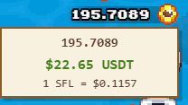

# Sunflower Land Balance Converter  

**Author: josevdr95**  

  

A browser extension that displays the equivalent USDT (dollar) value of your SFL (Sunflower Land) balance in the game.  

## 🔍 What is it?  

This extension shows the real-time USDT value of your SFL tokens when you click on the balance in Sunflower Land. A handy tool for tracking the actual worth of your in-game assets.  

## ⚙️ How it works  

1. **Interaction**: Click on any element with the `balance-text` class (excluding those with `mt-0.5`) to trigger a popup.  
2. **Conversion**: The system:  
   - Fetches the current SFL price in USD from CoinGecko (with a 2-minute cache)  
   - Converts your displayed balance to its USDT equivalent  
3. **Display**: Shows:  
   - Your original SFL balance  
   - The converted USDT value  
   - The current price of 1 SFL in USD  

## ✨ Features  

- Pixel-art styling to match the game's aesthetic  
- Responsive design (adjusts to stay on-screen)  
- Loading indicator with animated spinner  
- Error handling for failed API requests  
- Optimized: Caches prices to avoid redundant requests  

## 🖱️ Additional Behavior  

The popup automatically hides when:  
- Scrolling  
- Resizing the window  
- Clicking outside the popup  

## 💻 Technologies Used  

- Vanilla JavaScript (no dependencies)  
- CSS with pixel-art animations  
- CoinGecko API for price data  

## 🚀 Installation  

1. Clone this repository  
2. Load the extension in developer mode (Chrome/Edge: `chrome://extensions/`, Firefox: `about:debugging`)  
3. Open [Sunflower Land](https://sunflower-land.com) - the extension will work automatically!  

## 📄 License  

MIT License. See [LICENSE](LICENSE) for details.  

---  

**Note**: This is a fan-made tool and is not officially affiliated with Sunflower Land.